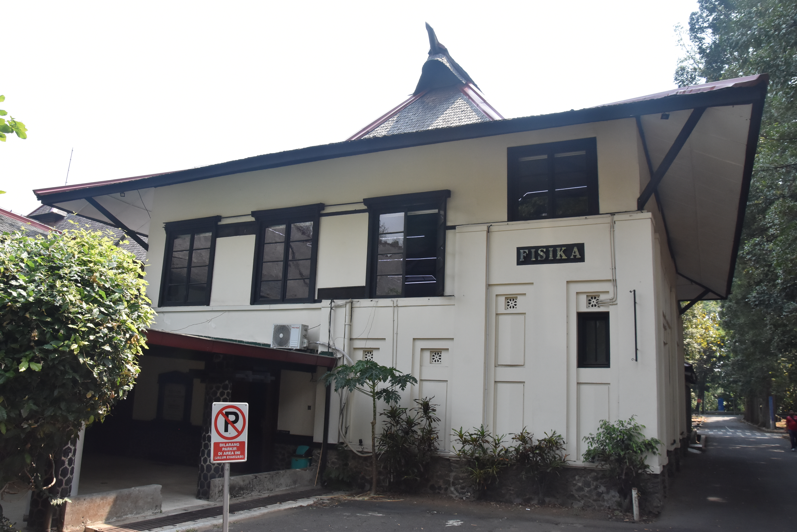
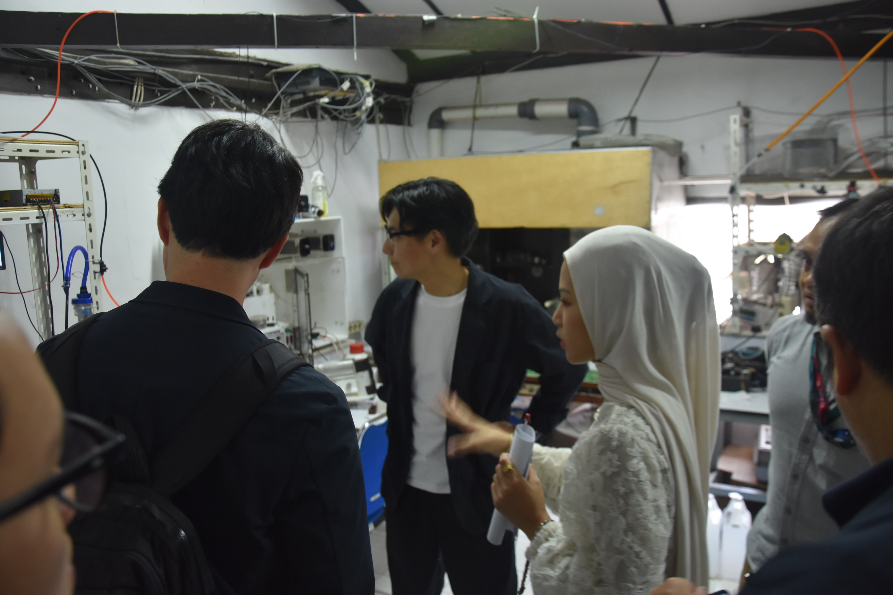
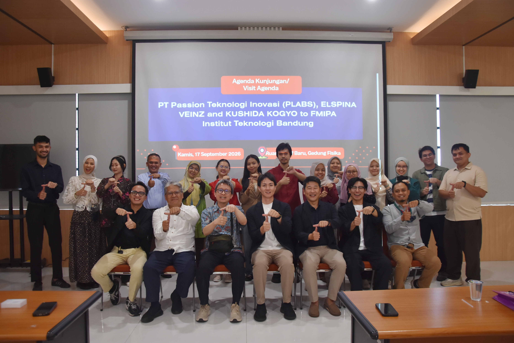
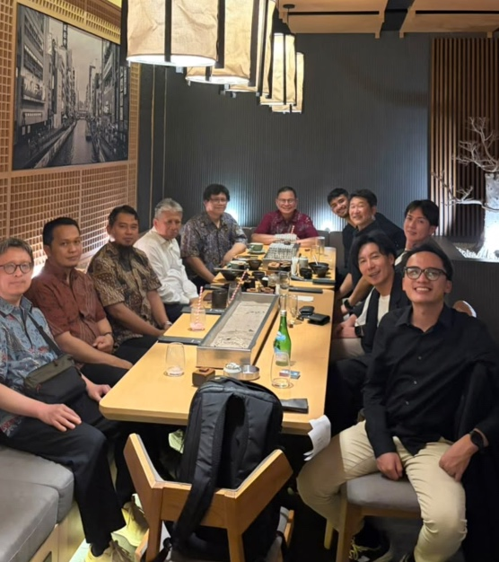

A visit from PLABS and ELSPINA VEINZ - KUSHIDA KOGYO to FMIPA ITB on Thu, 17 Sep 2026, 1300-1500 GMT+07

+ [`00`](pdf/00.pdf) Visit Agenda
+ [`01`](pdf/01.pdf) Physics Department Profile (Dr. Agus Suroso)
+ [`02`](pdf/02.pdf) IoT, Industry 4.0, and Smart System (Dr. Maman Budiman)
+ [`03`](pdf/03.pdf) Oil and Gas Pipeline Monitoring using FO (Prof. Bagus Endar)
+ [`04`](pdf/04.pdf) Digital Rock Physics: Workflow and Application Development (Dr. Fourier Latief)
+ [`05`](pdf/05.pdf) RAMAN-QA Software Platform (Prof. Mitra Djamal)
+ [`06`](pdf/06.pdf) Vegetable Oil Identification using NIR (Prof. Rachmat Hidayat)
+ [`07`](pdf/07.pdf) QCM Sensor Array Measurement System (Prof. Khairurrijal)
+ [`08`](pdf/08.pdf) Biophysics and Medical Physics Lab Research (Dr. rer. nat. Freddy Haryanto)
+ [`09`](pdf/09.pdf) Residual Waste Incinerator Research (Dr. Neni Surtiyeni)
+ [`10`](pdf/10.pdf) Chicken-Maggot Apartment: From Waste to Nutrition (Dr. rer. nat. Linus Pasasa)
+ `11` Electronics and Instrumentation Phycis Lab (Dr. Irfan Aditya)
+ `12` Many Entity Physical System (Dr. rer. nat. Sparisoma Viridi)
+ [`13`](pdf/13.pdf) List of Research Topics and Labs in Physics Department, FMIPA, ITB
